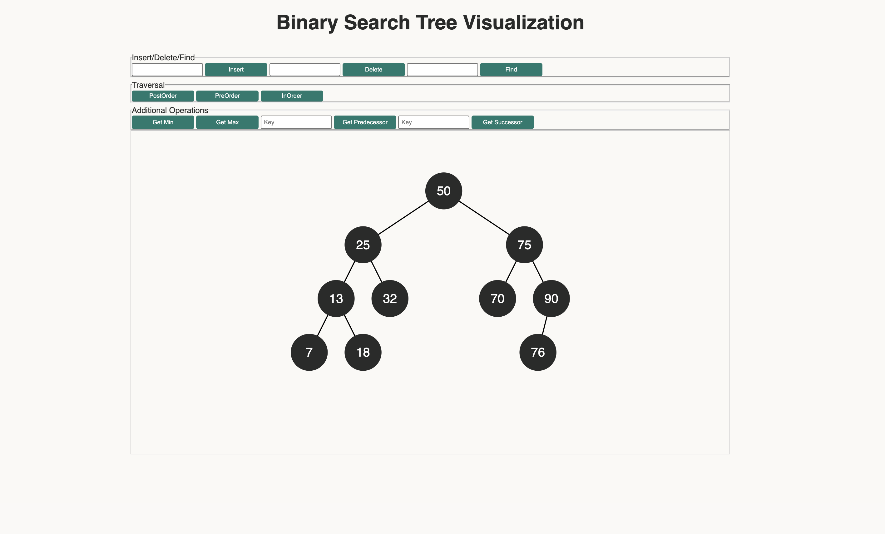

# BST Visualization

A dynamic, and interactive Binary Search Tree visualizer built with mostly d3.js, scss and a custom webpack setup.
You can insert, delete, find, and visualize depth-first search operations in real time.


## Installation & Usage
**1** Clone the repo
```
git clone https://github.com/idriss30/bstVisualizer.git

cd into folder
```
**2** Install dependencies
```
npm install
```

**3** Run in development </br>
Starts a local server with hot reload at localhost:8080
``` 
npm run start 
```

**4** Build for production
will create minified and optimized version of your assets
``` 
npm run build
```

## Tech Stack

- Javascript (es6+)
- d3.js
- Webpack,
- Babel
- Scss


## Features

- interactive operations : insert, delete, find, traverse etc...
- customizable Layout
- Single child offset
- Dynamic update


## Author

Created by me Idris.</br>
You can find me on [LinkedIn](https://www.linkedin.com/in/idrissciss/)

## See It live

You can see it live [here](https://idrisscissoko.com/bst/) </br>



